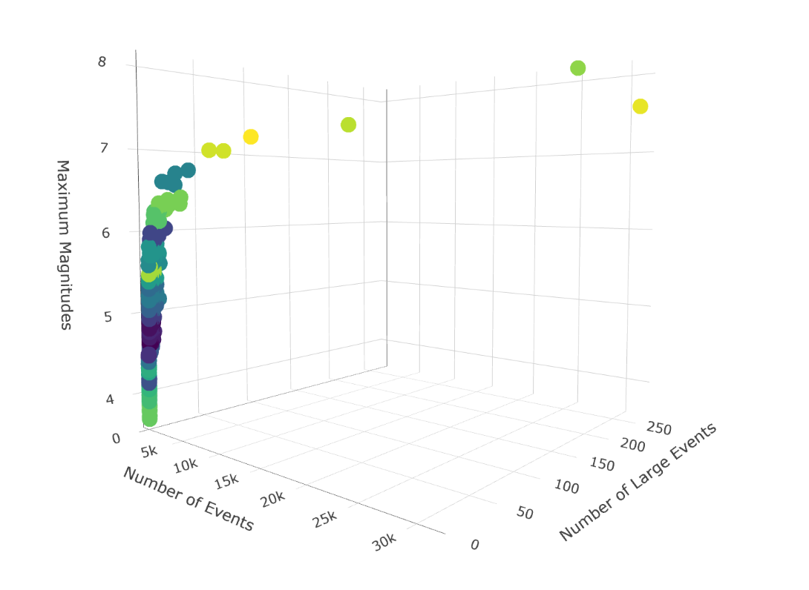
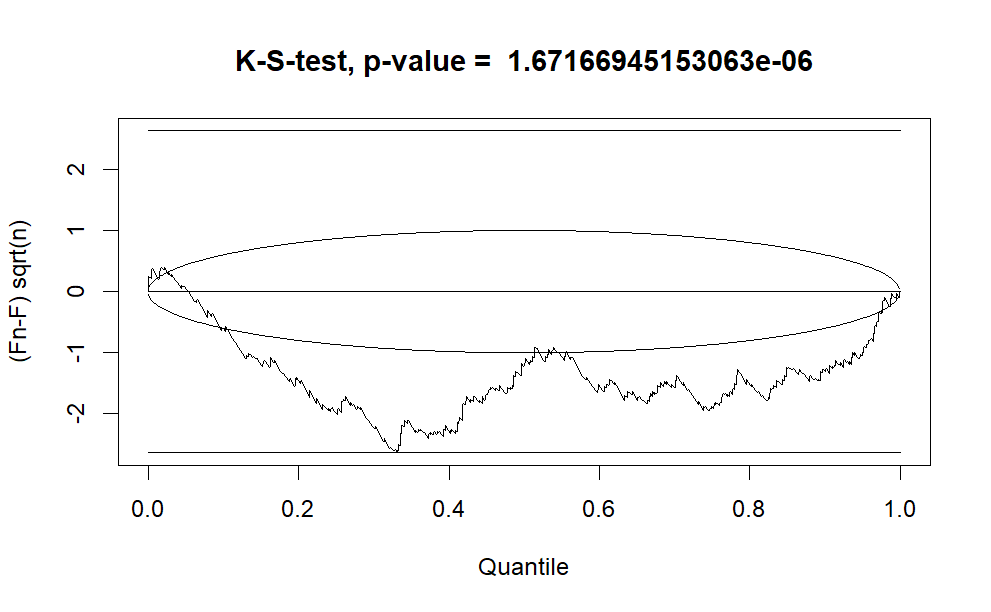
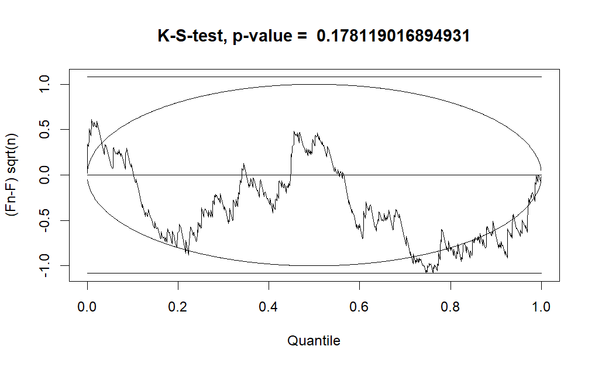

```{r setup, include = FALSE, message = FALSE, warning = FALSE}
# Install necessary packages, and load the data file if it exists.

if(!require(tidyverse)){
    install.packages('tidyverse')
}

if(!require(knitr)){
    install.packages('knitr')
}

if(!require(kableExtra)){
    install.packages('kableExtra')
}

knitr::opts_chunk$set(echo = TRUE)

if(!require(INLA)){
    install.packages('remotes')
    remotes::install_github('inlabru-org/inlabru')

    install.packages(
      'INLA',
      repos = c(getOption('repos'), 
                INLA = 'https://inla.r-inla-download.org/R/testing'),
      dep = TRUE
    )

    remotes::install_github('edinburgh-seismicity-hub/ETAS.inlabru')
}

if(!require(tidyquant)){
    install.packages('tidyquant')
}

if(!require(factoextra)){
    install.packages('factoextra')
}

if(!require(cluster)){
    install.packages('cluster')
}

if(!require(plotly)){
    install.packages('plotly')
}

if(file.exists('Dissertation.RData')){
    load('Dissertation.RData')
}
```

## Setting Up

Load packages, and set the number of cores.

```{r, message = FALSE, warning = FALSE}
require(tidyverse)
require(knitr)
require(kableExtra)
require(factoextra)
require(cluster)
require(ETAS.inlabru)
require(ggplot2)
require(plotly)
require(dplyr)
require(magrittr)
require(tidyquant)
require(rnaturalearth)
require(terra)
require(sf)
require(ggspatial)
require(rnaturalearthdata)
require(lubridate)

num.cores <- 1
future::plan(future::multisession, workers = num.cores)
INLA::inla.setOption(num.threads = num.cores)
```

## Prior Distributions

Prior distributions of the parameters are set up based on copula transformations.

```{r, eval = !file.exists('Dissertation.RData')}
# Copula transformations.
link.f <- list(
  mu = \(x) gamma_t(x, .3, .6),
  K = \(x) unif_t(x, 0, 10),
  alpha = \(x) unif_t(x, 0, 10),
  c_ = \(x) unif_t(x, 0, 10),
  p = \(x) unif_t(x, 1, 10)
)

# Inverse copula transformations.
inv.link.f <- list(
  mu = \(x) inv_gamma_t(x, .3, .6),
  K = \(x) inv_unif_t(x, 0, 10),
  alpha = \(x) inv_unif_t(x, 0, 10),
  c_ = \(x) inv_unif_t(x, 0, 10),
  p = \(x) inv_unif_t(x, 1, 10)
)
```

The prior distributions are sketched.

```{r, eval = !file.exists('Dissertation.RData')}
# Sample from standard normal distribution.
X <- rnorm(1000)

# Copula transformations.
gamma.X <- gamma_t(X, .3, .6)
unif.X <- unif_t(X, 0, 10)
unif.X.2 <- unif_t(X, 1, 10)

# Data frame for plotting.
df.to.plot <- rbind(
  data.frame(
    value = gamma.X,
    distribution = "Gamma(0.3, 0.6)"
  ),
  data.frame(
    value = unif.X,
    distribution = "Uniform(0, 10)"
  ),
  data.frame(
    value = unif.X.2,
    distribution = "Uniform(1, 10)"
  )
)
```

```{r, fig.cap = "Prior Distributions of the Parameters"}
# Plot the priors.
ggplot(df.to.plot, aes(value)) +
  geom_density() +
  theme_bw() +
  facet_wrap(facets = ~ distribution, scales = "free")
```

## HORUS Data and L'Aquila Sequence

```{r, eval = !file.exists('Dissertation.RData')}
# Transform HORUS time string in `Date` object, using `UTC` time zone.
horus$time_date <- as.POSIXct(
  horus$time_string,
  format = "%Y-%m-%dT%H:%M:%OS",
  tz = "UTC"
)

# Extract the L'Aquila sequence.
start.date <- as.POSIXct("2009-01-01T00:00:00", 
                         format = "%Y-%m-%dT%H:%M:%OS")
end.date <- as.POSIXct("2010-01-01T00:00:00", format = "%Y-%m-%dT%H:%M:%OS")
min.longitude <- 10.5
max.longitude <- 16
min.latitude <- 40.5
max.latitude <- 45
M0 <- 2.5 # Magnitude Cutoff.

# Conditions of selection.
aquila.sel <- (horus$time_date >= start.date) &
  (horus$time_date < end.date) &
  (horus$lon >= min.longitude) &
  (horus$lon <= max.longitude) &
  (horus$lat >= min.latitude) &
  (horus$lat <= max.latitude) &
  (horus$M >= M0)

# L'Aquila sequence.
aquila <- horus[aquila.sel, ]
```

Plot the map showing earthquake in Italy in 2009. Magnitudes: 3-5(black dots), 5-6(orange dots), $\geq 6$(red dot)

```{r, eval = !file.exists('Dissertation.RData')}
italy.map <- ne_countries(country = 'Italy', returnclass = "sf", 
                          scale = 'medium')

aquila.sf <- st_as_sf(aquila,
                     coords = c("lon", "lat"),
                     crs = st_crs('EPSG:4326'))
```

```{r, fig.cap = "Italian Earthquakes in 2009"}
ggplot() +
  geom_sf(data = aquila.sf[aquila$M > 3,], size = 0.8) +
  geom_sf(data = italy.map, fill = alpha("lightgrey", 0), colour = 'green',
          linewidth = 0.7) +
  geom_sf(data = aquila.sf[aquila$M > 5,], size = 0.9, colour = 'orange') +
  geom_sf(data = aquila.sf[aquila$M > 6,], size = 1, colour = 'red') +
  ggtitle("Map of event locations")
```

L'Aquila sequence, time versus magnitudes.

```{r, fig.cap = "L'Aquila Seismic Sequence, times versus magnitudes"}
ggplot(aquila, aes(time_date, M)) +
  geom_point() +
  theme_bw()
```

## Other Setups before Modelling

L'Aquila data frame.

```{r, eval = !file.exists('Dissertation.RData')}
# Data frame of L'Aquila.
aquila.bru <- data.frame(
  ts = as.numeric(
    difftime(aquila$time_date, start.date, units = "days")
  ),
  magnitudes = aquila$M,
  idx.p = 1 : nrow(aquila)
)
```

Initial values.

```{r, eval = !file.exists('Dissertation.RData')}
# Initial values.
th.init <- list(
  th.mu = inv.link.f$mu(.5),
  th.K = inv.link.f$K(.1),
  th.alpha = inv.link.f$alpha(1),
  th.c = inv.link.f$c_(.1),
  th.p = inv.link.f$p(1.1)
)
```

Start and end time points.

```{r, eval = !file.exists('Dissertation.RData')}
# Set starting and time of the time interval used for model fitting. 
# In this case, we use the interval covered by the data.
T1 <- 0
T2 <- max(aquila.bru$ts) + .2 
```

Bru options.

```{r, eval = !file.exists('Dissertation.RData')}
# Set up list of bru options.
bru.opt.list <- list(
  bru_verbose = 3, # Type of visual output.
  bru_max_iter = 70, # Maximum number of iterations.
  bru_initial = th.init # Initial values.
)
```

## ETAS Model

```{r, message = FALSE, warning = FALSE, eval = !file.exists('Dissertation.RData')}
ETAS <- function(data = aquila.bru, m0 = M0, t1 = T1, t2 = T2, 
                 ncore = num.cores, Link.f = link.f,
                 Bru.opt.list = bru.opt.list, n.samp = 1000, 
                 max.batch = 1000, mag = 4.5, n.breaks = 100, 
                 t.end.tri.post = 5, t.end.tri.prior = 10, 
                 t.end.omori.post = 5, t.end.omori.prior = 5){
    
    # This function aims at constructing the ETAS model, and returns a list of
    # modelling information.
    
    # Maximum likelihood estimator for β.
    beta.p <- 1 / (mean(data$magnitudes) - m0)
    
    # Fit the model
    model.fit <- Temporal.ETAS(
      total.data = data,
      M0 = m0,
      T1 = t1,
      T2 = t2,
      link.functions = Link.f,
      coef.t. = 1,
      delta.t. = .1,
      N.max. = 5,
      bru.opt = Bru.opt.list
    )
    
    # Create input list to explore model output.
    input_list <- list(
      model.fit = model.fit,
      link.functions = Link.f
    )
    
    # Get marginal posterior information.
    post.list <- get_posterior_param(input.list = input_list)
    
    # Plot marginal posteriors.
    postplot <- post.list$post.plot
    
    # Posterior sampling.
    post.samp <- post_sampling(
      input.list = input_list,
      n.samp = n.samp,
      max.batch = max.batch,
      ncore = num.cores
    )
    
    # Take the averages of the posterior parameter estimates.
    post.par <- apply(post.samp, 2, mean)
    
    # Pair plot.
    pair.plot <- post_pairs_plot(
      post.samp = post.samp,
      input.list = NULL,
      n.samp = NULL,
      max.batch = max.batch
    )
    pairplot <- pair.plot$pair.plot
    
    # Set additional elements of the list.
    input_list$T12 <- c(t1, t2)
    input_list$M0 <- m0
    input_list$catalog.bru <- data
    
    # Posterior number of events.
    N.post <- get_posterior_N(input.list = input_list)
    Npostplot <- N.post$post.plot
    Npostmean <- N.post$post.df[which.max(N.post$post.df$mean), 1] 
    
    # Number of large events.
    large_events <- data[data$magnitudes >= mag,]
    Nlarge <- nrow(large_events)
    
    # Mean absolute distance of the differences in magnitudes.
    diff_mag <- diff(data$magnitudes)
    abs_dist_mag <- mean(abs(diff_mag))
    
    # Mean absolute distance of the inter-arrival time. 
    interarrival <- diff(data$ts)
    abs_dist_int <- mean(abs(interarrival))
    
    # Check if over-dispersion occurs.
    m_int_time <- mean(interarrival)
    v_int_time <- var(interarrival)
    overdisp <- m_int_time ^ 2 < v_int_time
    
    # Triggering function plots.
    # Posterior plot.
    triplotpost <- triggering_fun_plot(
      input.list = input_list,
      post.samp = post.samp,
      n.samp = NULL, magnitude = mag,
      t.end = t.end.tri.post, n.breaks = n.breaks
    )
    
    # Prior plot.
    triplotprior <- triggering_fun_plot_prior(input.list = input_list, 
                              magnitude = mag, n.samp = n.samp, 
                              t.end = t.end.tri.prior)
    
    # Omori plots.
    # Posterior plot.
    omoripost <- omori_plot_posterior(input.list = input_list, 
                         post.samp = post.samp, 
                         n.samp = NULL, t.end = t.end.omori.post)
    
    # Prior plot.
    omoriprior <- omori_plot_prior(input.list = input_list, 
                                   n.samp = n.samp, 
                                    t.end = t.end.omori.prior)
    
    # Return the whole environment.
    envir <- as.list(environment())
    return(tibble::lst(envir))
}
etas <- ETAS()
```

Pair plot.

```{r, fig.cap = "Pair Plot for Parameters of the L'Aquila Sequence"}
etas$envir$pairplot
```

## Effects of mis-specifying parameters

```{r, message = FALSE, warning = FALSE, eval = !file.exists('Dissertation.RData')}
Copula <- function(mu_a = .3, mu_b = .6, 
                   k_a = 0, k_b = 10,
                   alp_a = 0, alp_b = 10,
                   c_a = 0, c_b = 10,
                   p_a = 1, p_b = 10){
    
    # This function aims at changing parameters of the prior distributions,
    # and outputs a list of all the information.
    
    # Copula transformations.
    linkf <- list(
      mu = \(x) gamma_t(x, mu_a, mu_b),
      K = \(x) unif_t(x, k_a, k_b),
      alpha = \(x) unif_t(x, alp_a, alp_b),
      c_ = \(x) unif_t(x, c_a, c_b),
      p = \(x) unif_t(x, p_a, p_b)
    )
    
    # Inverse copula transformations.
    invlinkf <- list(
      mu = \(x) inv_gamma_t(x, mu_a, mu_b),
      K = \(x) inv_unif_t(x, k_a, k_b),
      alpha = \(x) inv_unif_t(x, alp_a, alp_b),
      c_ = \(x) inv_unif_t(x, c_a, c_b),
      p = \(x) inv_unif_t(x, p_a, p_b)
    )
    
    # Initial values.
    thinit <- list(
      th.mu = invlinkf$mu(.5),
      th.K = invlinkf$K(1),
      th.alpha = invlinkf$alpha(1),
      th.c = invlinkf$c_(1),
      th.p = invlinkf$p(5)
    )
    
    # Set up list of bru options.
    bru.opt.list <- list(
      bru_verbose = 3, # Type of visual output.
      bru_max_iter = 70, # Maximum number of iterations.
      bru_initial = th.init # Initial values.
    )
    
    # Returns the whole environment.
    environ <- as.list(environment())
    return(tibble::lst(environ))
}

# Mis-specify the parameters.
cop_mis_mu <- Copula(mu_a = 5, mu_b = 1)
cop_mis_K <- Copula(k_a = .99, k_b = 1.01)
cop_mis_alp <- Copula(mu_a = .99, mu_b = 1.01)
cop_mis_c <- Copula(c_a = .99, c_b = 1.01)
cop_mis_p <- Copula(p_a = 4.9, p_b = 5.1)

# Fit the models.
etas_mis_mu <- ETAS(Link.f = cop_mis_mu$environ$linkf, 
                   Bru.opt.list = cop_mis_mu$environ$bruoptlist)
etas_mis_K <- ETAS(Link.f = cop_mis_K$environ$linkf, 
                   Bru.opt.list = cop_mis_K$environ$bruoptlist)
etas_mis_alp <- ETAS(Link.f = cop_mis_alp$environ$linkf, 
                   Bru.opt.list = cop_mis_alp$environ$bruoptlist)
etas_mis_c <- ETAS(Link.f = cop_mis_c$environ$linkf, 
                   Bru.opt.list = cop_mis_c$environ$bruoptlist)
etas_mis_p <- ETAS(Link.f = cop_mis_p$environ$linkf, 
                   Bru.opt.list = cop_mis_p$environ$bruoptlist)
```

Pair plots.

```{r, fig.cap = "Pair Plots for Parameters of the L'Aquila Sequence, with μ Mis-specified"}
# Mis-specifying μ. 
etas_mis_mu$envir$pairplot
```

```{r, fig.cap = "Pair Plots for Parameters of the L'Aquila Sequence, with K Mis-specified"}
# Mis-specifying K.
etas_mis_K$envir$pairplot
```

```{r, fig.cap = "Pair Plots for Parameters of the L'Aquila Sequence, with α Mis-specified"}
# Mis-specifying α.
etas_mis_alp$envir$pairplot
```

```{r, fig.cap = "Pair Plots for Parameters of the L'Aquila Sequence, with c Mis-specified"}
# Mis-specifying c.
etas_mis_c$envir$pairplot
```

```{r, fig.cap = "Pair Plots for Parameters of the L'Aquila Sequence, with p Mis-specified"}
# Mis-specifying p.
etas_mis_p$envir$pairplot
```

## Synthetic Catalogues Generation

```{r, message = FALSE, warning = FALSE, eval = !file.exists('Dissertation.RData')}
mult.synth.ETAS <- function(t1 = NULL, t2 = NULL, n.cat = 1000,
                     ht = NULL){
    
    # This function aims at generating `n.cat` synthetic catalogues in 
    # between T1 and T2, and the imposed history is set in `ht`.
    
    # Inherit the environment from the variable `etas`.
    envir <- etas$envir  
    
    # Update environments if specified by users.
    envir$t1 <- ifelse(!is.null(t1), t1, envir$t1)
    envir$t2 <- ifelse(!is.null(t2), t2, envir$t2)
    
    # Function to generate a synthetic catalogue.
    synth.gen <- function(i){
        iteration <- i
        synth <- generate_temporal_ETAS_synthetic(
                    theta = envir$post.par %>% as.list,
                    beta.p = envir$beta.p,
                    M0 = envir$m0, T1 = envir$t1,
                    T2 = envir$t2, Ht = ht, ncore = num.cores)
        return(synth)
    }
    
    # Generate catalogues as list of lists.
    multi.synth.cat.list <- lapply(seq_len(n.cat), \(x)
        synth.gen(x))

    # Stores catalogues as a list of data frames.
    multi.synth.cat.list.df <- lapply(multi.synth.cat.list,
                                      \(x) do.call(rbind, x))
    
    # Count the number of events in each catalogue.
    Nevents <- lapply(seq_len(n.cat), \(i) nrow(
        multi.synth.cat.list.df[[i]])) %>% unlist
    
    # Count the number of large events in each catalogue.
    mag <- etas$envir$mag
    Nlarge <- lapply(seq_len(n.cat), \(i) sum(
        multi.synth.cat.list.df[[i]]$magnitudes >= mag)) %>% unlist
    
    # Extract the highest magnitude in each catalogue.
    MaxMag <- lapply(seq_len(n.cat), \(i) max(
        multi.synth.cat.list.df[[i]]$magnitudes)) %>% unlist
    
    # Set catalogue identifiers.
    multi.synth.cat.list.df <- lapply(seq_len(n.cat),
                                      \(x) cbind(
                                          multi.synth.cat.list.df[[x]],
                                          cat.idx = x, 
                                          num_events = Nevents[x],
                                          num_large = Nlarge[x],
                                    max_mag = MaxMag[x] %>% round(2)))
    
    # Merge catalogues in a unique data frame.
    multi.synth.cat.df <- do.call(rbind, multi.synth.cat.list.df)
    
    # Return the whole environment.
    environ <- as.list(environment())
    return(tibble::lst(environ))
}

mult.synth <- mult.synth.ETAS(ht = NULL)
```

## Hierarchical Clutering and Sampling

```{r, message = FALSE, warning = FALSE, eval = !file.exists('Dissertation.RData')}
hier_clu_samp <- function(syn = mult.synth, kmax = 30){
    
    # This function aims at performing hierarchical clustering
    # for the synthetic catalogues specified in `syn`, as well as
    # selecting 1 sample in each of the `kmax` clusters.
    
    # Extract the number of events, the number of large events, as well as
    # the highest magnitude in each catalogue. 
    # Store them into a data frame, and rescale each column.
    multi.synth.cat.list.df <- syn$environ$multi.synth.cat.list.df
    syn.cat.info <- multi.synth.cat.list.df %>% length %>% seq_len %>% 
        lapply(\(i) multi.synth.cat.list.df[[i]][1, 5 : 7])
    synth.df <- do.call(rbind, syn.cat.info)
    synth.df.rescaled <- do.call(cbind, synth.df %>% ncol %>% seq_len %>% 
        lapply(\(x) (synth.df[, x] - min(synth.df[, x])) / 
                (max(synth.df[, x]) - min(synth.df[, x])))) 
    colnames(synth.df.rescaled) <- c('num_events_rescaled', 
                                  'num_large_rescaled', 
                                  'max_mag_rescaled')
        
    # Calculate the agglomerative coefficients for different 
    # linkage methods, and select the method with the highest
    # agglomerative coefficient.
    link_m <- c('single', 'complete', 'average', 'ward')
    agg_coef <- link_m %>% 
        sapply(\(i) (synth.df.rescaled %>% agnes(method = i))$ac)
    method <- agg_coef %>% which.max %>% names
    method <- ifelse(!(method == 'ward'), method, 'ward.D2')
    
    # Plot the Dendrogram.
    dendro <- synth.df.rescaled %>% 
                        dist(method = 'euclidean') %>% 
                        hclust(method = method) %>% as.dendrogram
    
    # Determine the optimal number of clusters up to `kmax`.
    opt_num <- clusGap(synth.df.rescaled, FUN = hcut, 
                        K.max = kmax, B = 20)$Tab[, 3] %>% which.max
    
    # Add a new column specifying the numbers of clusters.
    synth.final <- synth.df.rescaled %>% 
        cbind(
            cluster = synth.df.rescaled %>% 
                        dist(method = 'euclidean') %>% 
                        hclust(method = method) %>%
                        cutree(k = opt_num)
        )
    
    # Plot a 3-dimensional scatter plot of the final data frame.
    three_d_scatter <- plot_ly(x = synth.df[, 1], 
                               y = synth.df[, 2], 
                               z = synth.df[, 3], 
                               type = 'scatter3d', mode = 'markers', 
                               color = synth.final[, 4]) %>%
        layout(scene = 
                list(xaxis = list(title = 'Number of Events'),
                 yaxis = list(title = 'Number of Large Events'),
                 zaxis = list(title = 'Maximum Magnitudes')),
               legend = 
                list(title = list(text = 'Clusters')))
    
    # Discard catalogues having over 1600 events, since these might 
    # make the models crash.
    synth <- cbind(synth.df, synth.final[, 4])
    colnames(synth)[4] <- 'clusters'
    synth_1600 <- synth[synth$num_events <= 1600,]
    
    # Select 1 sample from each cluster.
    categories <- as.factor(synth_1600$clusters)
    samp.id <- ((categories %>% levels %>% as.numeric) %>%
        lapply(
            \(i) (synth_1600$clusters == i) %>% 
                which %>% sample(1))) %>% unlist %>% sample
    
    # Return the dendrogram, the 3D scatter plot, and the sample IDs.
    return(tibble::lst(dendro, three_d_scatter, samp.id))
}
hier_c <- hier_clu_samp(mult.synth) # Hierarchical clustering.
sampid <- hier_c$samp.id # IDs of the samples.
```

Dendrogram of the Clustered Catalogues.

```{r, fig.cap = "Dendrogram of the Clustered Catalogues"}
hier_c$dendro %>% plot(leaflab = 'none')
```

Run this chunk in `Rmarkdown` to get the 3D interactive scatter plot of the clustered catalogues.

```{r, eval = FALSE}
hier_c$three_d_scatter
```

3D Scatter Plot (static) of the Clustered Catalogues.

```{r, eval = file.exists('cluster3d.png'), fig.cap = "3D Scatter Plot of the Clustered Catalogues"}

```

```{r, message = FALSE, warning = FALSE, eval = !file.exists('Dissertation.RData')}
synth.model <- function(syn = mult.synth, 
                        slice = seq(1, 5, by = 1)){
    
    # This function aims at fitting an ETAS model on the synthetic catalogues
    # specified in `syn`.
    
    # Extract characteristics and sample IDs.
    Nevents <- syn$environ$Nevents
    Nlar <- syn$environ$Nlarge
    MaxMag <- syn$environ$MaxMag %>% round(2)
    samp.id <- sampid[slice]
    
    # Create a data frame of the catalogues to be plotted.
    cat.df.for.plotting <- rbind(
      syn$environ$multi.synth.cat.df[
        which(
          syn$environ$multi.synth.cat.df$cat.idx %in% samp.id), 
        ],
      cbind(syn$environ$envir$data[, c("ts", "magnitudes")],
        gen = NA, cat.idx = "observed", num_events = nrow(etas$envir$data),
        num_large = etas$envir$Nlarge, 
        max_mag = max(etas$envir$data$magnitudes) %>% round(2)
      )
    )

    # Plot synthetic catalogues.
    multi.synth.cat.plot <- ggplot(cat.df.for.plotting,
                                   aes(ts, magnitudes)) +
      geom_point(size = 0.5) +
      geom_point(
        data = syn$environ$ht, 
        mapping = aes(ts, magnitudes), colour = "black"
      ) +
      facet_wrap(facets = vars(cat.idx, num_events, num_large, max_mag), 
                 labeller = 'label_both', ncol = 6)
    
    # ETAS model fitting.
    
    post <- rep(list(NULL), samp.id %>% length) # Posterior list.
    post.par <- matrix(rep(0, (samp.id %>% length) * 5), 
                       ncol = 5) # Posterior parameters.
    
    for(i in samp.id %>% length %>% seq_len){
        # Fit the ETAS model.
        multi.synth.etas <- ETAS(data = 
            syn$environ$multi.synth.cat.list.df[[samp.id[i]]],
                                    t1 = syn$environ$envir$t1, 
                                    t2 = syn$environ$envir$t2)
        
        # Store the information.
        post[[i]] <- multi.synth.etas$envir$post.list
        post.par[i,] <- multi.synth.etas$envir$post.par
        
        # Legends of the plots.
        post[[i]]$post.df$Catalogues <- 
        paste('Random Catalogue', i, ':\n', Nevents[samp.id[i]],
              'Events, with', Nlar[samp.id[i]], 'Large Events,\n',
              'and the Highest Magnitude is', MaxMag[samp.id[i]])
    }
    
    # Define a data frame for true parameters.
    df.true.param <- data.frame(x = etas$envir$post.par, 
                        param = names(etas$envir$post.par %>% as.list))
    
    # Bind marginal posterior data frames.
    bind.post.df <- do.call(rbind, 
                            lapply(samp.id %>% length %>% seq_len,
                                   \(i) post[[i]]$post.df))
    
    # Plot the posterior parameter plots.
    post.par.plot <- ggplot(bind.post.df, 
                            aes(x = x, y = y, colour = Catalogues)) +
      geom_line() +
      facet_wrap(facets = ~ param, scales = "free") +
      xlab("param") +
      ylab("pdf") +
      geom_vline(
        data = df.true.param,
        mapping = aes(xintercept = x), linetype = 2
      )

    # Return the whole environment.
    environ <- as.list(environment())
    return(tibble::lst(environ))
}
# Fit the model of the sampled organic catalogues.
mult.synth.fit <- lapply(seq_len(5), \(i) synth.model(syn = mult.synth,
                            slice = seq(5 * (i - 1) + 1, 5 * i, by = 1)))
```

Synthetic catalogues, time vs magnitudes.

```{r, fig.cap = "Synthetic Catalogues, Time vs Magnitudes"}
mult.synth.fit[[1]]$environ$multi.synth.cat.plot
mult.synth.fit[[2]]$environ$multi.synth.cat.plot
mult.synth.fit[[3]]$environ$multi.synth.cat.plot
mult.synth.fit[[4]]$environ$multi.synth.cat.plot
mult.synth.fit[[5]]$environ$multi.synth.cat.plot
```

Posterior plots of the catalogues.

```{r, fig.cap = "Posterior Plots for Parameters of Random Synthetic Catalogues"}
mult.synth.fit[[1]]$environ$post.par.plot
mult.synth.fit[[2]]$environ$post.par.plot
mult.synth.fit[[3]]$environ$post.par.plot
mult.synth.fit[[4]]$environ$post.par.plot
mult.synth.fit[[5]]$environ$post.par.plot
```

## Analysis on the Behaviours of the Time-between-Events

### For Organic Catalogues

```{r, message = FALSE, warning = FALSE, eval = !file.exists('Dissertation.RData')}
ECDF.interarrival <- function(j){
    
    # This function aims at sketching ECDF and KS plots of the 
    # organic catalogues with a baseline of the L'Aquila sequence.
    
    # Extract characteristics and sample IDs.
    samp.id <- mult.synth.fit[[j]]$environ$samp.id
    Nevents <- mult.synth.fit[[j]]$environ$Nevents
    Nlar <- mult.synth.fit[[j]]$environ$Nlar
    MaxMag <- mult.synth.fit[[j]]$environ$MaxMag
    
    # Create a list of data frames specifying the time-between-events
    # of each catalogue.
    data.list <- lapply(samp.id %>% length %>% seq_len, \(i) data.frame(
        Time_between_events = 
            mult.synth$environ$multi.synth.cat.list.df[[samp.id[i]]]$ts %>%
                sort %>% diff, 
        Catalogues = paste('Random Catalogue', i, ':\n', 
                           Nevents[samp.id[i]],
              'Events, with', Nlar[samp.id[i]], 'Large Events,\n',
              'and the Highest Magnitude is', 
              MaxMag[samp.id[i]] %>% round(2))
        )
    )
    
    # Create a data frame specifying the time-between-events
    # of the real sequence.
    data.list[[length(samp.id) + 1]] <- data.frame(
        Time_between_events = etas$envir$interarrival, 
        Catalogues = paste('Observed', ':\n', nrow(etas$envir$data),
              'Events, with', etas$envir$Nlarge, 'Large Events,\n',
              'and the Highest Magnitude is', 
              max(etas$envir$data$magnitudes) %>% round(2)))
    
    # Bind the rows of the data frames.
    df <- do.call(rbind, data.list)
    
    # Plot ECDF.
    ECDF.plot <- ggplot(df, aes(x = Time_between_events, 
                                colour = Catalogues)) +
        stat_ecdf() + 
        xlab('Time between Events') +
      ylab('Empirical Cumulative Probability')
    
    # Plot KS.
    KS.plot <- samp.id %>% length %>% seq_len %>% lapply(
        \(i) data.list[[i]]$Time_between_events %>% 
            inla.ks.plot(
                data.list[[samp.id %>% length + 1]]$Time_between_events %>%
                             ecdf))
    
    return(tibble::lst(ECDF.plot, KS.plot))
}

ecdf_interarrival <- lapply(seq_len(5), \(j) ECDF.interarrival(j))
```

ECDF plots for organic catalogues.

```{r, fig.cap = "ECDF Plots of Time between Events, without Imposing History"}
ecdf_interarrival[[1]]$ECDF.plot
ecdf_interarrival[[2]]$ECDF.plot
ecdf_interarrival[[3]]$ECDF.plot
ecdf_interarrival[[4]]$ECDF.plot
ecdf_interarrival[[5]]$ECDF.plot
```

An example KS test plot for an organic catalogue.

```{r, eval = file.exists('ks_org_best.png'), fig.cap = "An Example KS Plot of Time between Events, without Imposing History"}

```

### For Catalogues with Imposed History

```{r, message = FALSE, warning = FALSE, eval = !file.exists('Dissertation.RData')}
ECDF.interarrival.imp <- function(n.cat = 10, data = etas$envir$data){
    
    # This function aims at sketching ECDF and KS plots of the catalogues 
    # with the maximum-magnitude event imposed with a baseline of the 
    # L'Aquila sequence.
    
    # Generate synthetic catalogues, imposing history.
    mult.synth.imp <- mult.synth.ETAS(n.cat = n.cat, 
                                      ht = data[which.max(data$magnitudes),])
    
    # Extract characteristics and sample IDs.
    Nevents <- mult.synth.imp$environ$Nevents
    Nlar <- mult.synth.imp$environ$Nlar
    MaxMag <- mult.synth.imp$environ$MaxMag
    
    # Create a list of data frames specifying the time-between-events
    # of each catalogue.
    data.list <- lapply(n.cat %>% seq_len, \(i) data.frame(
        Time_between_events = 
            mult.synth.imp$environ$multi.synth.cat.list.df[[i]]$ts %>%
                sort %>% diff, 
        Catalogues = paste('Random Catalogue', i, ':\n', Nevents[i],
              'Events, with', Nlar[i], 'Large Events,\n',
              'and the Highest Magnitude is', 
              MaxMag[i] %>% round(2))
        )
    )
    
    # Create a data frame specifying the time-between-events
    # of the real sequence.
    data.list[[n.cat + 1]] <- data.frame(
        Time_between_events = etas$envir$interarrival, 
        Catalogues = paste('Observed', ':\n', nrow(etas$envir$data),
              'Events, with', etas$envir$Nlarge, 'Large Events,\n',
              'and the Highest Magnitude is', 
              max(etas$envir$data$magnitudes) %>% round(2)))
    
    
    # Bind the rows of the data frames.
    df <- do.call(rbind, data.list)
    
    #Plot ECDF.
    ECDF.plot <- ggplot(df, aes(x = Time_between_events, 
                                colour = Catalogues)) +
        stat_ecdf() + 
        xlab('Time between Events') +
      ylab('Empirical Cumulative Probability')
    
    KS.plot <- n.cat %>% seq_len %>% lapply(
        \(i) data.list[[i]]$Time_between_events %>% 
            inla.ks.plot(data.list[[n.cat + 1]]$Time_between_events %>%
                             ecdf))
    
    return(tibble::lst(ECDF.plot, KS.plot))
}

ecdf_interarrival_imp <- ECDF.interarrival.imp()
```

ECDF plots for catalogues imposing history.

```{r, fig.cap = "ECDF Plots of Time between Events, Imposing History"}
ecdf_interarrival_imp$ECDF.plot
```

An example KS test plot for a catalogue imposing history.

```{r, eval = file.exists('ks_imp_best.png'), fig.cap = "An Example KS Plot of Time between Events, Imposing History"}

```

```{r, include = FALSE, eval = !file.exists('Dissertation.RData')}
# Save the data file.
save.image(file = 'Dissertation.RData')
```
